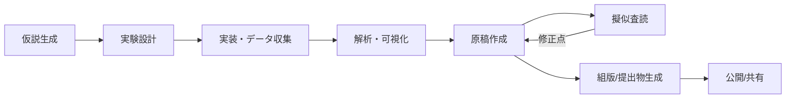

# Virtuous Machines: Towards Artificial General Science を噛み砕く

> この記事は，「自分の理解を深めたい」という気持ちで書いています．読者のみなさんと**同じ目線**で，一緒に理解を育てていくスタイルです．僕の理解が及ばない部分があれば，優しく教えていただけると幸いです！

# TL;DR
LLM×エージェントで“仮説→実験→解析→論文化”まで **自律的** に回す研究．オンライン実験（人間被験者 288 名）を含む 3 つの心理実験を**ほぼ無人で**設計・実行・原稿化し，図表や参考文献検証まで自動化． **ただし** 概念的な独創性や理論解釈の練度には課題．安全性・信用・功績帰属の枠組みづくりが超重要．

# はじめに — なぜ今「自律研究エージェント」なのか

* 研究論文の爆増，専門細分化で**俯瞰と統合が難化**．
* AlphaFold のような**狭い領域の超人 AI**はあるが，科学の全工程を横断する **汎用的な“研究エージェント”** は未成熟．
* 本論文は，そのギャップに対して「**仮説生成→設計→データ収集→解析→図表→原稿→擬似査読**」までを **エンドツーエンド** で回す **ドメイン非依存のエージェント・フレームワーク** を提示．

# 何をやったの？（貢献の一言まとめ）

* **人間参加のオンライン心理実験**（視覚ワーキングメモリ／メンタルローテーション／イメージ鮮明度）を **自動で設計・運用**．
* **8 時間以上の連続コーディング**で解析パイプラインも自動生成．
* **図表・キャプション・参考文献照合（DOI 検証）・擬似査読**まで自動化し，**完成原稿**を出力．
* **限界**：理論的なニュアンスや創造性，因果説明の明確さはまだ人間研究者に劣る．

# システム全体像（アーキテクチャ）

マスターエージェントが研究プロジェクトを統括し，各工程を **モジュール化エージェント** に委譲：

* **Idea/仮説生成エージェント**
* **Method/手法設計エージェント**（実験計画，手続き，倫理・制約の考慮）
* **Data/実装・収集エージェント**（オンライン実験実行，ログ収集）
* **Analysis/解析エージェント**（コーディング，統計，可視化）
* **Visuals/図表エージェント**（複数パネルの図表とキャプション，Word/LaTeX 両対応）
* **Manuscript/原稿エージェント**（章立て，関連研究の再文脈化，引用の DOI 検証）
* **Review/擬似査読エージェント**（構成・方法・統計・文章品質の診断）
* **Document/組版エージェント**（最終原稿を Word/LaTeX で生成）

## 人間を模した「認知オペレータ」

長期計画や自己検証が苦手な LLM を補うため，

* **Abstraction（抽象化）**: 汎用則から自前の手順書を導く
* **Metacognition（メタ認知）**: 進捗点検・自己評価・再計画
* **Decomposition（分解）**: 問題を実装可能なタスクに細分化
* **Autonomy（自律）**: 工具選択・反復改善・境界条件の更新
  を **明示的に回す制御層** を設計．

## （Mermaid）全体フロー図

# 実験の中身（心理学 3 テーマ）

1. **視覚ワーキングメモリとメンタルローテーションの関係**

   * 課題難易度の上昇に伴う成績低下の **傾き（スロープ）** を個人ごとに推定し，2 領域で相関するか検証．
   * **結果**：有意な相関は見られず，共有リソース仮説に **反証的**．信頼性（split-half）も吟味し，計測妥当性の課題を指摘．

2. **イメージ鮮明度と系列依存（serial dependence）**

   * 心象の鮮明さが短期視覚記憶の系列バイアスに影響するか検討．

3. **視覚記憶精度と空間課題の結びつき**

   * 空間タスクとのリンクは **ほぼ無視できる** ほど小さいことを示唆．

> ※ 3 本とも **オンライン参加者でデータ収集**．1 本は **新規に 288 名**を集め，他 2 本は既存データの再解析（論文では 3 本分の **完成原稿**も付録として公開）．

# 成果とインパクト（解釈）

* **できたこと**：

  * 研究計画→実験運用→解析→図表→原稿→チェックまで **一気通貫** の自動化．
  * 既存の“狭い用途の AI”を超えて，**科学のワークフロー**全体を **横断**．
* **まだのこと**：

  * **因果機構の説明**や**理論の創出**の深さは未到達．説明性・一般化原理の提示は今後の課題．
* **位置づけ**：

  * これまでの**in silico（計算機内）研究自動化**を飛び出し，**人間実験**を含むエンドツーエンド自律運用を **初めて** 系統的に提示（主張）．

# 倫理・安全・信用（ここが超大事）

* **安全**：プロンプトインジェクション／ツール悪用のリスク，研究の大量自動生成による **低品質ノイズや p-hacking** の懸念．
* **社会的合意**：

  * 誰に\*\*功績（クレジット）\*\*を帰属する？
  * 研究不正・失敗の**責任**は誰が負う？
  * **透明性**（自動生成の開示，ログ，再現用アーティファクト）と **再評価（replication）** の仕組みが必須．
* **運用提案**：

  * 各ステージでの **オプション人手検証**，**出力検証ログ**の標準化，**AI 生成研究の検出指標**の整備．

# 再現・実装メモ

* ワークフローは **企業（Explore Science）による独自実装**．現時点では**完全なオープン再現は困難**．
* ただし，設計思想（モジュール化・認知オペレータ層・DOI 検証・擬似査読）は **一般化可能**．
* 研究者が自前で試すなら：

  * マルチエージェント（LangChain/AutoGen/自作）＋ **実験プラットフォーム API**（Prolific，Pavlovia など）
  * 統計：Python（pandas, statsmodels, pingouin）／R（tidyverse, lme4）
  * 図表自動化：Jupyter + Matplotlib/Plotly，Word/LaTeX への自動出力
  * **DOI 照合**と**引用整形**は専用スクリプト化（Crossref/doi.org API）

# 研究の限界（著者自身の自己評価＋私見）

* **理論的独創性**：過去文献の再解釈は堅実だが，**新奇な理論命題**は控えめ．
* **説明責任**：自動生成の意思決定ログをどこまで公開し，**批判可能性**を担保できるか．
* **外部妥当性**：心理実験以外（ロボティクス・化学合成など **物理実験**）へのスケールには **追加設計**が必要．

# こんな読者に刺さる

* LLM エージェントで **研究自動化**を設計・運用したい
* **オンライン実験**を自動設計・自動運用したい
* 研究の **透明性・再現性**を高める運用ルールを考えたい

# 関連リンク

* **タイトル**：*Multi-head Transformers Provably Learn Symbolic Multi-step Reasoning via Gradient Descent*
* **著者**：Tong Yang, Yu Huang, Yingbin Liang, Yuejie Chi
* **年**：2025
* **arXiv**： [arXiv:2508.08222](https://arxiv.org/abs/2508.08222) 

# 付録：図表エージェントの分担（例）

* 図面：**コーディング担当／デバッグ担当／視覚検品担当／キャプション担当**の 4 ユニットで分業．LaTeX/Word 両対応．
* 表：LaTeX と Word 生成を両対応し，査読向け体裁を自動化．

# まとめ（一言）

> **“発見”の自動化はもう始まっている．** 次は，**安全・信用・功績のルール**を科学コミュニティ全体で設計する番．
